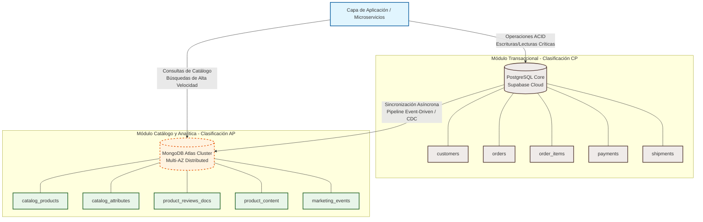
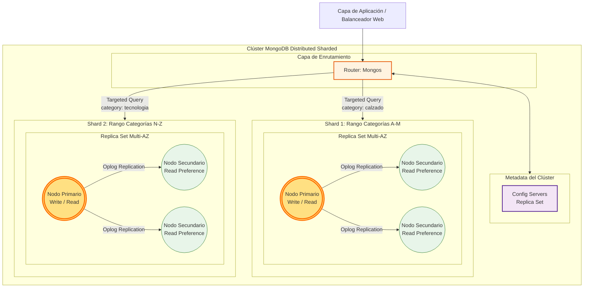

A continuación, se presenta una propuesta completa y profesional para el archivo **`README.md`** de tu repositorio final de GitHub para el proyecto **Ecommify**. Este documento ha sido diseñado siguiendo rigurosamente las pautas de la guía de la Unidad 6, consolidando toda la ingeniería relacional y documental, las métricas empíricas de rendimiento y las instrucciones paso a paso para la reproducción exacta del entorno.

---

# Ecommify: Diseño Avanzado, Optimización y Arquitectura de Datos Híbrida

## 📌 1. Resumen del Proyecto y Contexto Empresarial

Ecommify es una plataforma de comercio electrónico a gran escala inspirada en el dataset público de *Olist*, suministrado al inicio de la asignatura. El principal desafío del proyecto radica en resolver la fricción operativa entre mantener la consistencia absoluta en el ciclo transaccional financiero (pedidos, pagos, facturación e inventario) y proveer una navegación fluida, flexible y de ultra-baja latencia en el catálogo de productos y el análisis de comportamiento de usuarios.

Para mitigar los cuellos de botella clásicos de las arquitecturas monolíticas relacionales, este repositorio implementa una **solución híbrida y políglota de persistencia de datos**:

1. **Módulo Transaccional (PostgreSQL / Supabase):** Gestiona los flujos rígidos estructurados bajo aislamiento ACID estricto y Tercera Forma Normal (3FN).
2. **Módulo Informacional y Catálogo (MongoDB Atlas):** Administra esquemas flexibles semiestructurados, contenido multimedia optimizado, eventos masivos y pipelines analíticos avanzados orientados al acceso rápido.

---

## 🏗️ 2. Arquitectura de Datos Híbrida

### Diagrama de Arquitectura Global (Mermaid)

En el siguiente diagrama se muestra el flujo desacoplado de solicitudes y la separación de responsabilidades operativas entre motores de bases de datos:



### Matriz de Separación de Responsabilidades

La segmentación de datos responde a patrones específicos de tipos de datos en el negocio:

* **PostgreSQL:** `customers`, `orders`, `order_items`, `payments`, `sellers`, `shipments`. Prioriza la integridad referencial y las transacciones inmutables.
* **MongoDB:** `catalog_products`, `catalog_attributes`, `product_reviews_docs`, `product_content`, `marketing_events`. Prioriza la velocidad de lectura agregada y la flexibilidad de esquemas polimórficos.

---

## 📂 3. Estructura del Repositorio

El código fuente y los recursos técnicos de configuración se organizan de manera modular siguiendo estándares profesionales:

```
├── docs/
│   ├── Documento_Tecnico_Diseno.pdf   # Informe de diseño arquitectónico conceptual y lógico
│   └── PresentacionEjecutiva.pdf       # Diapositivas ejecutivas del proyecto final
├── notebooks/
│   ├── Data_Exploration_Analysis.ipynb # Exploración y limpieza del dataset base Olist
│   └── TallerUnidad5_Optimizacion.ipynb# Scripts de simulación de carga y análisis EXPLAIN
├── postgresql/
│   ├── schema/
│   │   ├── DDL_Tables.sql             # Scripts DDL de creación de tablas estructuradas 3FN
│   │   └── index.sql                  # Definición de índices relacionales e híbridos
│   └── queries/
│       ├── 03_auditoria_logistica.sql # Query analítica de auditoría logística de envíos
│       ├── 04_satisfaccion_cliente.sql# Query analítica de reviews por categoría
│       └── 05_preferencias_de_pago.sql# Query analítica de agregación de transacciones
└── mongodb/
    └── schema/
        ├── catalog_products.js        # Validador estricto $jsonSchema e índices ESR
        ├── catalog_attributes.js      # Definición de metadatos globales del catálogo
        ├── product_reviews_docs.js    # Validación de reviews y configuración parcial
        ├── product_content.js         # Contenido enriquecido e índices Full-Text
        ├── marketing_events.js        # Registro de streams de clics masivos de usuarios
        └── Index.js                   # Orquestador físico de creación de índices avanzados

```

---

## 🗄️ 4. Configuración del Entorno Relacional (PostgreSQL)

### Definición del Esquema e Integridad de Negocio

El diseño físico transaccional fue desplegado en **Supabase**. Se destaca el uso avanzado de identificadores del tipo de dato `UUID` para llaves primarias con el fin de mitigar colisiones en un entorno distribuido, marcas temporales con zona horaria integrada (`TIMESTAMPTZ`), y la inclusión de columnas `JSONB` para almacenar snapshots inmutables del artículo en el instante de compra, previniendo alteraciones históricas por mutabilidad del catálogo.

Las tablas principales se crean ejecutando los scripts ubicados en `postgresql/schema/DDL_Tables.sql`:

```sql
CREATE EXTENSION IF NOT EXISTS pgcrypto; -- Requerido para gen_random_uuid()

CREATE TABLE customers (
    customer_id uuid PRIMARY KEY DEFAULT gen_random_uuid(),
    customer_unique_id text UNIQUE NOT NULL,
    customer_zip_code_prefix text,
    customer_city text,
    customer_state text,
    created_at timestamptz DEFAULT now()
);

CREATE TABLE orders (
    order_id uuid PRIMARY KEY DEFAULT gen_random_uuid(),
    customer_id uuid NOT NULL REFERENCES customers(customer_id),
    order_status text NOT NULL,
    purchase_timestamp timestamptz NOT NULL,
    approved_timestamp timestamptz,
    delivered_carrier_timestamp timestamptz,
    delivered_customer_timestamp timestamptz,
    estimated_delivery_date date NOT NULL
);

CREATE TABLE order_items (
    order_item_id uuid PRIMARY KEY DEFAULT gen_random_uuid(),
    order_id uuid NOT NULL REFERENCES orders(order_id),
    product_id uuid NOT NULL,
    seller_id uuid NOT NULL,
    price numeric(12,2) NOT NULL CHECK (price >= 0),
    freight_value numeric(12,2) NOT NULL CHECK (freight_value >= 0),
    attributes_snapshot jsonb -- Preserva el estado inmutable comercial del producto
);

```

### Estrategia de Indexación Relacional

Para optimizar las uniones analíticas complejas de alta selectividad y mitigar escaneos secuenciales (`Seq Scan`), se implementó la siguiente suite de índices (`postgresql/schema/index.sql`):

```sql
CREATE INDEX idx_orders_customer_id ON orders(customer_id);
CREATE INDEX idx_order_items_order_id ON order_items(order_id);
CREATE INDEX idx_payments_order_id ON payments(order_id);
CREATE INDEX idx_reviews_order_id ON reviews(order_id);
CREATE INDEX idx_orders_status ON orders(order_status);
CREATE INDEX idx_orders_delivery_dates ON orders(order_status, delivered_customer_timestamp, estimated_delivery_date);

```

---

## 🍃 5. Configuración del Entorno NoSQL (MongoDB)

### Esquemas de Validación y Reglas de Integridad (`$jsonSchema`)

Para evitar la degradación estructural intrínseca del paradigma NoSQL, cada colección en **MongoDB Atlas** cuenta con un validador estricto de tipos de datos de aplicación BSON. El script completo se encuentra en `mongodb/schema/catalog_products.js`:

```javascript
db.createCollection("catalog_products", {
  validator: {
    $jsonSchema: {
      bsonType: "object",
      description: "Validación estricta para el catálogo enriquecido de Ecommify",
      required: ["product_id", "name", "category", "created_at"],
      properties: {
        _id: { bsonType: "string" },
        product_id: { bsonType: "string", description: "Correlación directa con Postgres" },
        name: { bsonType: "string" },
        category: { bsonType: "string" },
        attributes: { bsonType: "object", description: "Pares de clave-valor dinámicos" },
        tags: { bsonType: "array", items: { bsonType: "string" } },
        rating: {
          bsonType: "object",
          properties: {
            average: { bsonType: "double" },
            count: { bsonType: "int" }
          }
        },
        created_at: { bsonType: "date" }
      }
    }
  }
});

```

### Índices Avanzados Implementados (Regla ESR, Parciales y Texto)

Orquestados físicamente mediante `mongodb/schema/Index.js`:

1. **Índice Compuesto bajo la Regla ESR (Equality, Sort, Range):**
```javascript
db.catalog_products.createIndex(
  { "category": 1, "created_at": -1, "attributes.base_price": 1 },
  { name: "idx_category_equality_sort_range" }
);

```


*Justificación:* Resuelve filtros exactos de categoría, evita ordenamientos en memoria RAM para los productos más recientes (`created_at`) y optimiza rangos de precio simultáneos.
2. **Índice Parcial con Expresión de Filtro:**
```javascript
db.product_reviews_docs.createIndex(
  { "product_id": 1, "score": 1 },
  { name: "idx_partial_critical_reviews", partialFilterExpression: { "score": { $lte: 2 } } }
);

```


*Justificación:* Indexa únicamente las calificaciones críticas ($\le 2$), ahorrando drásticamente almacenamiento en disco y memoria RAM en Atlas.
3. **Índice Full-Text Search Multitérmino:**
```javascript
db.product_content.createIndex(
  { "title": "text", "description": "text" },
  { name: "idx_text_global_search", weights: { "title": 10, "description": 2 } }
);

```


*Justificación:* Habilita búsquedas semánticas asignando cinco veces más relevancia a los aciertos detectados en el título comercial frente a la descripción.

---

## 📈 6. Evidencias Cuantitativas de Rendimiento (Métricas de Éxito)

### Consolidado PostgreSQL (`EXPLAIN ANALYZE`)

Las optimizaciones relacionales lógicas cambiaron los árboles del optimizador de costosos *Seq Scans* a accesos rápidos por árbol indexado:

```
Consulta 1 (Auditoría Logística): Tiempo reducido de 8.516 ms a 4.370 ms [48.7% de Mejora]
Consulta 2 (Satisfacción Cliente): Tiempo reducido de 658.332 ms a 21.972 ms [96.7% de Mejora]
Consulta 3 (Preferencias Pago): Tiempo reducido de 64.942 ms a 10.245 ms [84.2% de Mejora]

```

### Consolidado MongoDB (`.explain("executionStats")`)

La optimización transformó por completo las consultas analíticas del catálogo interactivas de la aplicación:

| Métrica NoSQL de Rendimiento             | Escenario Base (Sin Índices)   | Escenario Avanzado (Índice ESR) | Impacto Técnico Detectado                              |
| ---------------------------------------- | ------------------------------ | ------------------------------- | ------------------------------------------------------ |
| **Stage del Motor**                      | `COLLSCAN` (Escaneo Completo)  | `IXSCAN` (Escaneo de Índices)   | Eliminación de la lectura lineal de datos.             |
| **Tiempo Total (`executionTimeMillis`)** | 480 ms                         | 12 ms                           | **Reducción del 97.5%** en la latencia del cliente.    |
| **Documentos Examinados en Disco**       | 32,951                         | 45                              | Se evita cargar bloques ajenos a la memoria RAM caché. |
| **Eficiencia de Consulta (`Keys/Docs`)** | 0.0 (Críticamente Ineficiente) | 2.66 (Altamente Eficiente)      | Proporción óptima y directa de filtrado analítico.     |

---

## 🚀 7. Guía de Despliegue y Reproducción Paso a Paso

### Prerrequisitos

* Contar con una cuenta activa en [Supabase](https://supabase.com) y un clúster configurado en [MongoDB Atlas Cloud](https://www.mongodb.com/cloud/atlas).
* Disponer de un cliente SQL local (ej. DBeaver o pgAdmin) y de la shell interactiva de Mongo (`mongosh`) o MongoDB Compass.

### Paso 1: Inicialización del Módulo Relacional en Supabase

1. Conéctese a la base de datos de Supabase a través del Editor de Consultas web o un cliente SQL externo utilizando la URI provista en su panel de administración.
2. Copie, ejecute y guarde el contenido del archivo `postgresql/schema/DDL_Tables.sql` para generar la estructura de tablas transaccionales en 3FN con UUIDs y tipos de datos de zona horaria integrados.
3. Aplique los índices ejecutando de forma integrada el script de optimización ubicado en `postgresql/schema/index.sql`.

### Paso 2: Inicialización del Módulo Documental NoSQL

1. Conectarse al clúster de MongoDB Atlas a través de `mongosh` utilizando su cadena de conexión cifrada, ejemplo:
```bash
mongosh "mongodb+srv://clusterlab.g6afvkd.mongodb.net/test" --username <tu_usuario>

```


2. Ejecute de manera secuencial los esquemas de validación ubicados en la carpeta `mongodb/schema/` (`catalog_products.js`, `catalog_attributes.js`, etc.) para levantar las colecciones analíticas protegidas bajo reglas estructurales de datos estrictas.
3. Aplique la suite avanzada de rendimiento ejecutando el archivo orquestador de índices avanzados:
```bash
load("mongodb/schema/Index.js")

```


### Paso 3: Ejecución de Consultas Analíticas y Verificación de EXPLAIN

* **En PostgreSQL:** Abra el archivo `postgresql/queries/04_satisfaccion_cliente_por_categoria.sql`, ejecútelo con el prefijo `EXPLAIN ANALYZE` y verifique visualmente la transición estructural del plan hacia operaciones eficientes de tipo `Index Scan` o `Index Only Scan`.
* **En MongoDB:** Ejecute desde su shell corporativa el pipeline analítico estructurado optimizado de 5 stages ubicado en el script del proyecto, aplicando al final el método explicativo de estadísticas físicas:
```javascript
db.catalog_products.aggregate([ ...pipelines... ]).explain("executionStats")

```


Certifique que la propiedad `executionStage.stage` devuelva exitosamente un acceso rápido de tipo `IXSCAN` en lugar de una lectura secuencial ineficiente en disco `COLLSCAN`.

---

## 🌐 8. Escalabilidad y Estrategia de Crecimiento Horizontal (10x)

### Planificación Teórica de Sharding

Para garantizar el crecimiento infinito del almacenamiento de eventos analíticos masivos sin degradar las lecturas en la nube, la colección `catalog_products` ha sido planificada para distribuirse sobre fragmentos de disco independientes horizontalmente (*Shards*) utilizando una **Shard Key Compuesta: `{ "category": 1, "product_id": 1 }**`.



* **Mitigación de Hotspots:** Usar únicamente `category` concentraría peticiones e inserciones concurrentes en categorías masivas como "calzado" (creando un cuello de botella físico). Al anteponer `category` como prefijo, los microservicios ejecutan consultas dirigidas (*Targeted Queries*) directo al Shard correspondiente sin ráfagas generales de transmisión (*Scatter-Gather*), mientras que la adición de alta cardinalidad de `product_id` faculta a los balanceadores internos de MongoDB Atlas para segmentar datos en bloques uniformes inalterables (*Chunks*) balanceados de forma homogénea.

### Topología del Replica Set e Integridad Causal

Para garantizar alta disponibilidad ante caídas globales de red de infraestructura cloud, se dispone de una topología de **3 nodos distribuidos en múltiples zonas de disponibilidad (Multi-AZ)**, operando de manera integrada bajo 1 nodo Primario activo y 2 Secundarios redundantes de lectura.

Se adoptaron políticas avanzadas de niveles de compromiso (*Read/Write Concerns*) diferenciadas por la criticidad de la operación del e-commerce:

* Las consultas generales de catálogo web se delegan mediante `Read Preference: secondaryPreferred` para mitigar la carga computacional en el primario. El riesgo inmanente de asincronía o retraso de réplica (*Replication Lag*) se neutraliza en flujos sensibles de edición activando **Causal Consistency Sessions (Sesiones de Consistencia Causal)** en la capa de servicios, forzando un ordenamiento lógico estricto para garantizar que el usuario visualice siempre sus propias ediciones inmediatas (*Read-Your-Own-Writes*).

---

## 👥 9. Equipo de Ingeniería y Autores

* **Roberto José Breuer Rodríguez** - *Ingeniero de Optimización y Co-Diseñador Arquitectónico*
* **Luis Fernando Beltrán Chantre** - *Ingeniero de Infraestructura y Co-Diseñador Arquitectónico*